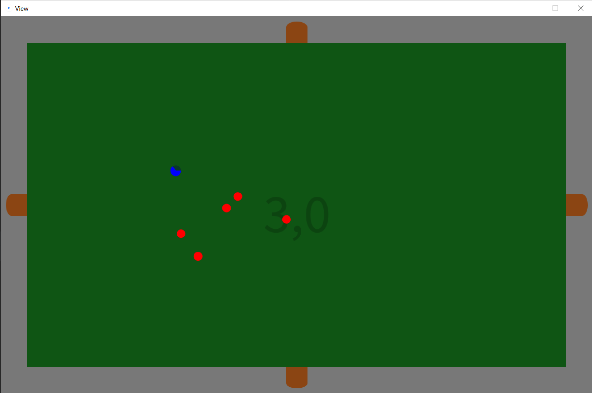
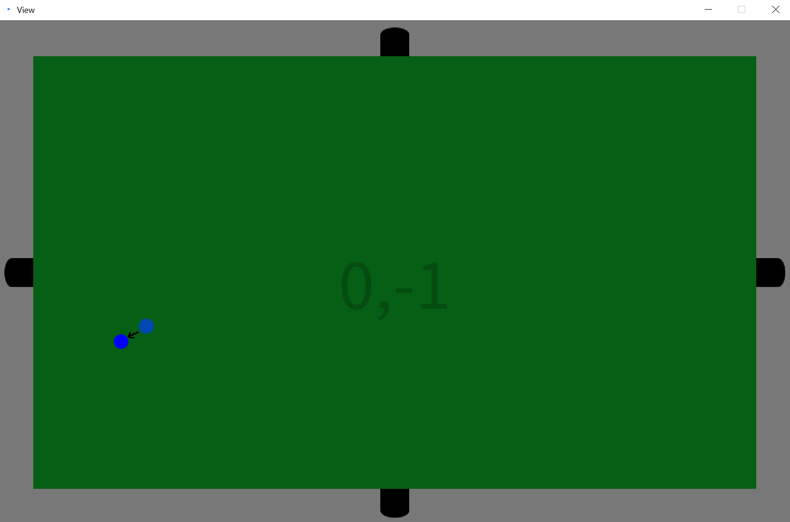
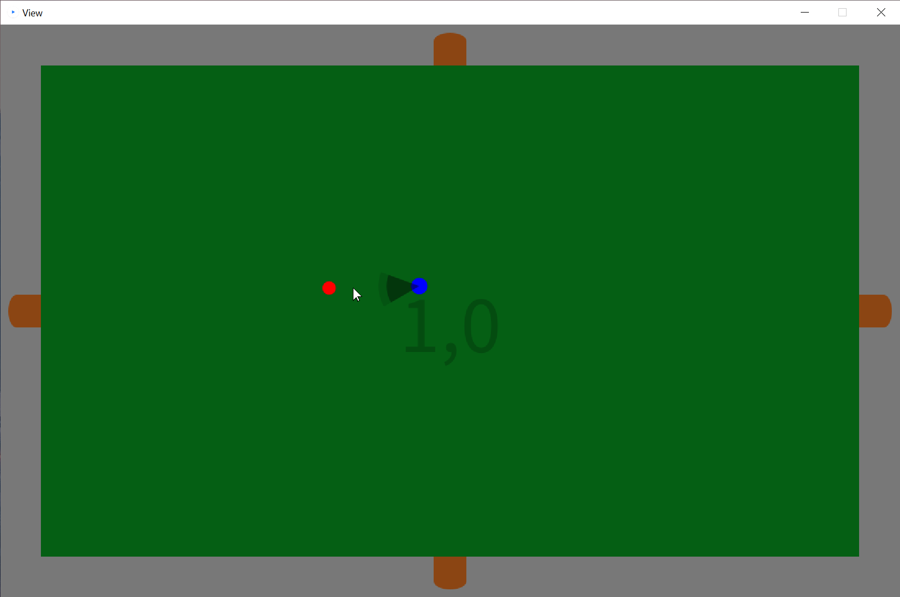

# ReadMe – Roguelite

## 1. Spielerklärung



Das implementierte Spiel ist ein Rogue-lite. Es ist ein Spiel indem man auf einer
Kachelbasierten Oberwelt, wobei man von jeder Kachel die jeweiligen benachbarten Kacheln
betreten kann. Des weiteren gilt Perma-Death, heißt nach jedem Tod setzt sich der Spieler
Character zurück und es wird eine neue Welt generiert.

Auf jeder Kachel, außer der Startkachel, spawnt eine Gruppe Gegner, welche den Spieler
versucht umzubringen. Die Größe der Gruppe und die jeweiligen Lebenspunkte werden
zufällig, aber beeinflusst durch die Distanz zur Startkachel, generiert. Diese Gegner
versuchen den Spieler umzubringen. Dazu können sich sie sich in alle 360° einer Fläche
bewegen. Der Spieler wiederum kann nur in vielfachen von 45° sich bewegen.

Zum Angriff generieren Spieler und Gegner ein Kreis Segment vor sich. Dieses teilt allen dem
Ersteller unfreundlichen Lebewesen, welche das Segment berühren, schaden zu. Es gibt aber
einen minimalen zeitlichen Abstand zwischen Attacken (Im Falle des Spielers ½ Sekunden).

Das Ziel des Spieles ist es eine möglichst große Distanz zur Startkachel aufzubauen, bevor
man stirbt.

## 2. Spielen mit View

Das Spielen mit einer mit Processing generierten Grafischen Oberfläche ist sehr leicht.


Um das Spiel zu starten führt man einfach die, sich in der Main Klasse befindende, Main
Methode aus, diese stellt alle Einstellung von selbst ein. Möglicherweise muss man nun das
Processing-fenster einmal anklicken, um eingaben wahrzunehmen.



Nun kann man sich einfach mit w, a, s und d nach jeweils oben, links, rechts, unten und links
bewegen. Des Weiteren ist es möglich mehrere Richtungen auf einmal auszuwählen und es
wird dabei in die resultierende Richtung gelaufen.



Mit einem linken Mausklick wird wiederum eine Attacke, aus Sicht der Spielfigur in Richtung
des Mauszeigers.


## 3. Spielen in der JShell

Das Spielen in der JShell ist um einiges unangenehmer, da man nur alle halbe Sekunde eine
Liste aller Lebewesen auf der aktuellen Kachel, mit deren Klassenname, Position und HP.

Man startet das Spiel einfach indem man einen neuen Spieler generiert.

```
Player p = new Player(int x, int y, boolean godmode, boolean textout)
```

* int x: breite des Spielfelds (Empfehlung größer 30)

* int x: breite des Spielfelds (Empfehlung größer 30)

* boolean godmode: true: Kein reset so bald HP <= 0

* false: reset so bald HP <= 0

* boolean textout: 
    * true: jede halbe Sekunde wird eine Liste aller aktuell lebendigen Lebewesen ausgegeben
    * false: Konsole wird nur zur Info bei falsch eingaben genutzt nun kann man sich bewegen mit.
```
p.keyInput(int[], int mx, int my)
```

* int[]: Repräsentiert alle möglichen Tasten die gedrückt werden
    können. Eine 1 stellt eine gedrückte Taste dar, eine 0 eine
    ungedrückte.

* 0: in Richtung 0 auf der X-Achse gehen

* 1: in Richtung max. auf der X-Achse gehen

* 2: in Richtung 0 auf der Y-Achse gehen

* 3: in Richtung max. auf der Y-Achse gehen

* 5: Attacke ausführen

* mx: Punkt auf der X-Achse in dessen Richtung Attacken ausgeführt werden.
* my: Punkt auf der X-Achse in dessen Richtung Attacken ausgeführt werden.

Da mx und my keine Auswirkung auf Bewegungen haben, können diese, wenn man sich nur
Bewegen will, mit beliebigen Zahlen gefüllt werden.

Man beachte beim Generieren einer Attacke, dass falls die letzte Attacke weniger als 0,5s
her wird keine neue Attacke ausgeführt.


Außerdem hat man zugriff auf Methoden wie:
* Screen:
    * getlocked(): gibt an ob die Türen einer Kachel offen sind
    - getSize(): gibt die Größe der Kachel
    - getLocation(): gibt den Offset einer Kachel vom Startpunk an
    - export(): gibt eine Liste an Kopien aller Lebewesen der Kachel
    - textout(): gibt alle relevanten Informationen einer Kachel aus

* ScreenElement:
    - copy(): um eine Kopie des aktuellen ScreenElements, mit allen
        relevanten Informationen zu bekommen
    - getPos(): um die aktuelle Position zu bekommen
    - friendly(int t) gibt aus ob ein Team t freundlich ist
    - facedirNsize(): gibt die facedir und die Größe in Form eines Tupels aus
    - run(): startet threads... sind sie aber schon lohnt sich also nur
        wenn man einen Fehler generieren will
    - textout(): gibt alle relevanten Infos in der Konsole aus

* Player:
    - getScreen(): um die aktuelle Kachel zu bekommen

* DamageSemiCircles
    - get deg: gibt den Öffnungs-Radius
