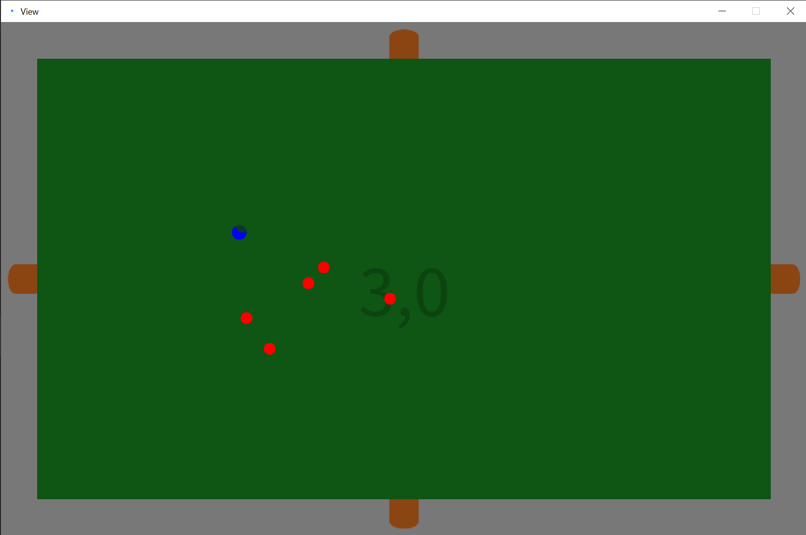
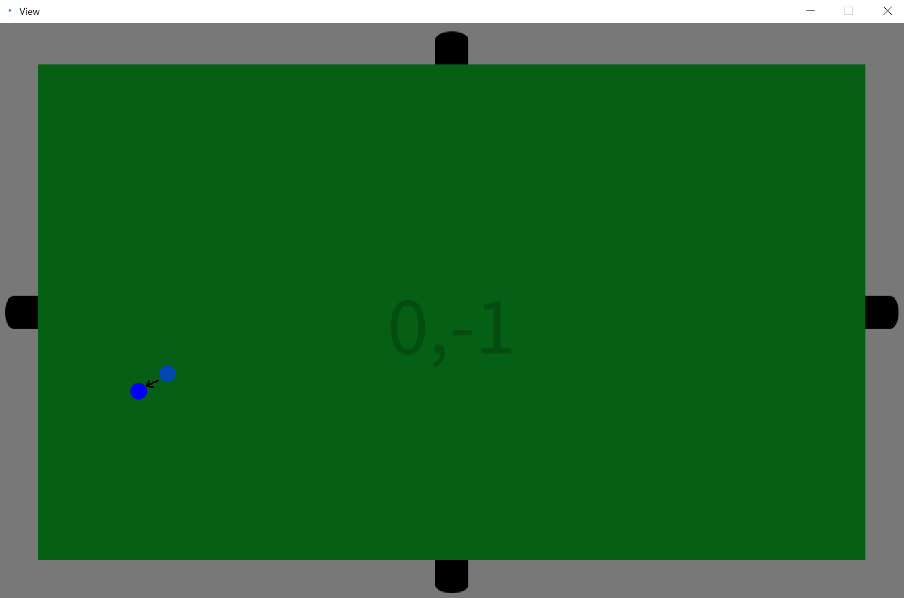
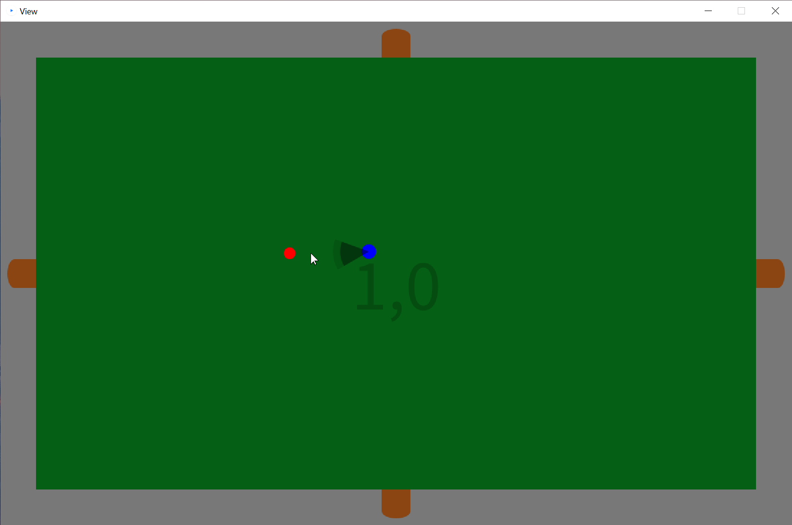

# ReadMe – Roguelite

## 1. Game explanation



The implemented game is a rogue-lite. It is a game where you navigate a tile-based overworld, being able to enter the adjacent tiles from each tile. Furthermore, it features permadeath, meaning that after each death, the player character resets, and a new world is generated.

On every tile, except the starting tile, a group of enemies spawns, attempting to kill the player. The size of the group and their respective health points are randomly generated but influenced by the distance from the starting tile. These enemies try to kill the player by moving in all 360° directions within an area. The player, on the other hand, can only move in multiples of 45°.

For attacking, both the player and enemies generate a circular segment in front of them. This segment inflicts damage to any unfriendly beings that it touches. However, there is a minimum time interval between attacks (in the case of the player, it's half a second).

The goal of the game is to build up the largest possible distance from the starting tile before dying.

## 2. Spielen mit View

Playing the game with a graphical interface generated by Processing is very easy.


To start the game, simply execute the Main method located in the Main class, which automatically adjusts all the settings. You may need to click on the Processing window once to register inputs


Now you can simply move using the keys w, a, s, and d, which correspond to up, left, right, and down, respectively. It is also possible to select multiple directions simultaneously, and the character will move in the resulting direction.



A left mouse click triggers an attack in the direction of the mouse pointer, relative to the player's perspective.


## 3. Playing in JShell

Playing in JShell is less convenient, as you can only get a list of all living entities on the current tile every half second, including their class name, position, and HP.

To start the game, simply create a new player:

```
Player p = new Player(int x, int y, boolean godmode, boolean textout)
```

* int x: width of the game field (recommended value is larger than 30)

* int x: height of the game field (recommended value is larger than 30)

* boolean godmode: 
    * true: no reset when HP <= 0
    * false: no reset when HP <= 0

* boolean textout: 
    * true: outputs a list of all currently living entities every half second
    * false: the console is only used for error information; movement is possible
```
p.keyInput(int[], int mx, int my)
```

* int[]: Represents all possible keys that can be pressed. A value of 1 represents a pressed key, while 0 represents an unpressed key.

* 0: move in the direction 0 on the X-axis

* 1: move in the maximum direction on the X-axis

* 2: move in the direction 0 on the Y-axis

* 3: move in the maximum direction on the Y-axis

* 5: perform an attack

* mx: point on the X-axis in the direction where attacks are executed
* my: point on the Y-axis in the direction where attacks are executed

If you only want to move and don't want to consider mx and my, you can fill them with any arbitrary numbers.

Note that if the last attack occurred less than 0.5 seconds ago, a new attack will not be executed.

In addition, you have access to methods such as:
* Screen:
    * getlocked(): indicates whether the doors of a tile are open
    - getSize(): returns the size of the tile
    - getLocation(): returns the offset of a tile from the starting point
    - export(): returns a list of copies of all entities on the tile
    - textout(): outputs all relevant information of a tile as a String

* ScreenElement:
    - copy(): returns a copy of the current ScreenElement, including all relevant information
    - getPos(): returns the current position
    - friendly(int t) indicates whether a team t is friendly
    - facedirNsize(): returns the facedir and size as a tuple
    - run(): starts threads (only useful if they are not already running, unless you want to generate an error)
    - textout(): outputs all relevant information in the console
* Player:
    - getScreen(): returns the current tile
* DamageSemiCircles
    - get deg: returns the opening radius
